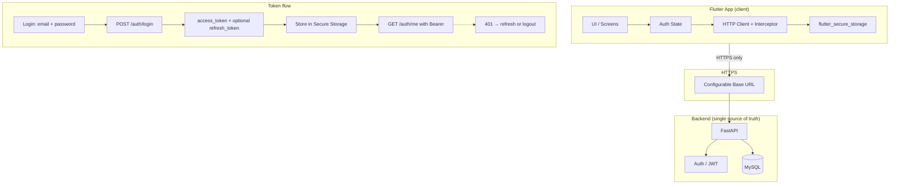
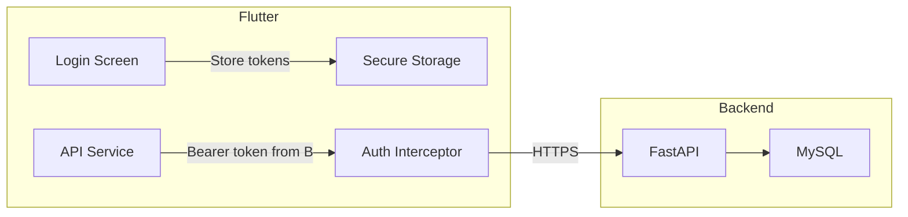

# Barangay Legal Aid — Architecture & Security (PDPA/RA 10173)

**Context:** Philippine legal-aid mobile app. Data subject to PDPA (Data Privacy Act) and RA 10173. This document defines the production-grade, secure architecture and refactor rationale.

---

## A. Architecture Recommendation & Reasoning

### Online-first vs offline

**Recommendation: Online-first, backend as single source of truth.**

| Aspect | Online-first (chosen) | Hybrid/offline |
|--------|------------------------|----------------|
| **Credentials** | Never stored on device; JWT in secure storage only | Passwords/hashes on device → device compromise = full credential leak |
| **PII (ID photos, chats)** | Server-only; client displays URLs or redacted metadata | Base64 in SharedPreferences / local DB → PDPA violation, breach scope |
| **Session** | Backend validates token; revocation works | Local “isLoggedIn” + demo fallback → spoofable, no real revocation |
| **RBAC** | Backend enforces; client only for UX (redirect) | Client-side role checks → easily bypassed |
| **Audit** | Server logs who did what; supports compliance | No reliable audit trail for admin actions |

**Why drop local DB for sensitive data**

- **Current:** `app_database.dart` stores `users` (including `password_hash`), `cases`, `chat_sessions`, `chat_messages`. Duplicates backend and creates a second copy of PII on the device.
- **Risk:** Device loss, malware, or backup extraction exposes all sensitive data. PDPA requires minimization and security of personal data.
- **Decision:** Remove sqflite for users, cases, requests, chats. Use backend APIs for all CRUD. Optionally keep a **read-only cache** for FAQ (non-PII) or offline FAQ display only.

### Single source of truth

- **FastAPI + MySQL:** Users, auth, cases, document requests, chats, logs. Passwords hashed server-side (e.g. bcrypt). No plaintext passwords over the wire (HTTPS + hashed payload if needed; standard is form login over HTTPS).
- **Flutter app:** Pure API client. No password storage, no ID photo bytes in prefs, no `password_hash` in local DB. Tokens in `flutter_secure_storage` only; baseUrl from env (e.g. `flutter_dotenv`).

### Token flow (JWT)

- Login: POST credentials → backend returns `access_token` (+ optional `refresh_token`).
- Client stores tokens only in **flutter_secure_storage** (no SharedPreferences).
- All API calls: `Authorization: Bearer <access_token>`. Optional: dedicated HTTP client with interceptor to attach token and handle 401 (retry with refresh token or force re-login).
- Logout: Clear tokens from secure storage; optionally call backend logout endpoint to invalidate refresh token.

### Mermaid: High-level architecture and token flow

**Summary**

- **Flutter** → **HTTPS** → **FastAPI** → **MySQL**. No local replica of users/passwords/PII.
- Tokens only in **flutter_secure_storage**; **baseUrl** from environment (e.g. `.env`).
- Auth interceptor: attach Bearer, on 401 refresh or clear storage and redirect to login.

---

## G. High-priority privacy fix plan (admin chat / cases / requests)

**PDPA/RA 10173 risk:** Admin screens that show full user messages, case details, or document requests without consent/audit can violate data minimization and purpose limitation.

### Admin Chats screen (`screens/admin/chats_screen.dart`)

- **Current:** Lists all chat messages with `message`, `sender_id`, `receiver_id`, `created_at` (full PII of conversations).
- **Options (pick one or combine):**
  1. **Metadata only:** Show only session-level metadata (e.g. session id, user id, message count, last activity). No message body. Add “View” that requires a justified reason and logs access (audit).
  2. **Remove feature:** If not legally required, remove the admin chat list; keep only analytics (e.g. counts).
  3. **Backend redaction:** Backend returns redacted or summarized content; Flutter only displays what API returns.
- **Actions:** Add audit logging for any admin access to chat data (who, when, what resource). Guard route so only role from backend can open this screen.

### Cases and Requests screens

- **Cases:** Ensure admin sees only cases they are allowed to (e.g. by barangay). Backend must enforce; client should not show “all cases” unless backend says so. Add audit log when admin opens a case.
- **Requests:** Same as cases — scope by role/barangay, audit when viewing sensitive request details.
- **Recommendation:** Backend returns only what the role is entitled to; Flutter does not request “all” and display client-side filter. Add a simple “Access log” or “Audit” section for superadmin.

### Implementation order

1. Backend: Add audit log table and endpoints (who viewed what, when).  
2. Backend: Add role/barangay-scoped list for cases and requests; optional redacted chat list.  
3. Flutter: Replace full message list in Admin Chats with metadata-only list + optional “Request access” that calls backend (and logs).  
4. Flutter: Ensure cases/requests lists use backend filtering (no “fetch all then filter” client-side).  
5. Flutter: Add guarded routes so only users with backend-returned admin/superadmin role can open these screens.

---

## H. Migration guide: remove local users, rotate creds, deploy securely

### 1. Backend readiness

- Implement or verify: `POST /auth/register` (multipart: ID photo + fields). Store only hashed password and ID photo URL/hash.
- Implement or verify: `PUT /auth/me` (profile update), `POST /auth/change-password` (current + new password).
- Use HTTPS in production; set CORS and secure cookies if using web.

### 2. Remove local sensitive data (Flutter)

- **Done in this refactor:** No more password or ID photo in SharedPreferences; no demo users; token only in `flutter_secure_storage`.
- **Optional cleanup:** Remove any remaining keys from SharedPreferences: `password`, `idPhotoBase64`, `idPhotoFilename`, `access_token` (migrated to secure storage). You can run a one-time “migration” on app upgrade that deletes these keys.
- **sqflite:** Stop creating or using tables `users`, `cases`, `chat_sessions`, `chat_messages` in `app_database.dart`. Either remove those tables in a DB migration (drop tables) or delete the DB file on upgrade and keep only FAQ cache if needed.

### 3. Rotate credentials

- Invalidate all existing tokens (e.g. change JWT secret or revoke all refresh tokens).
- Remove hardcoded demo accounts from backend if any; require real signup/login.
- Ask users to sign in again and, if applicable, change password.

### 4. Configure production

- Set `.env` or build-time config: `API_URL=https://your-api.example.com` (no trailing slash).
- Do not commit production secrets; use CI/env for production builds.
- Ensure `flutter_secure_storage` is used for tokens only (already done).

### 5. Deploy order

1. Deploy backend (HTTPS, register/me/change-password, audit logging if added).  
2. Deploy Flutter app (this refactor) with production `API_URL`.  
3. Communicate to users: re-login required; optional password change.  
4. Monitor logs for 401s and failed logins; fix any remaining client or server issues.

---

## I. Prioritized list of remaining files to refactor

1. **request_form.dart** — Replace direct `http.get('http://127.0.0.1:8000/auth/me')` and SharedPreferences token with `AuthService.getCurrentUser()` (or ApiService) and configurable baseUrl. Resolve `barangay_id` from backend user or barangays list.
2. **user_profile_page.dart** — Already switched to Provider; ensure phone/address come from backend after profile update (or keep prefs as cache only).
3. **Admin/SuperAdmin dashboards and screens** — Use `Provider.of<AuthService>` and `Provider.of<ApiService>` instead of constructing new instances. Guard routes: after navigation, verify role from `getCurrentUser()` and redirect if not allowed.
4. **screens/admin/chats_screen.dart** — Apply privacy fix (G): metadata-only or remove full message list; add audit when backend supports it.
5. **screens/admin/cases_screen.dart**, **requests_screen.dart**, **users_screen.dart** — Use ApiService from Provider; ensure backend enforces scope; add loading/error states and mounted checks.
6. **screens/superadmin/** (barangays, admins, analytics, backup, logs, settings, system) — Replace any hardcoded `127.0.0.1` or localhost in UI with `apiBaseUrl` or “Server” label; use ApiService from Provider; remove or implement fake toggles/backup.
7. **app_database.dart** — Remove sensitive tables (users, cases, chat_sessions, chat_messages) or entire DB if not needed; keep only optional FAQ cache table.
8. **widget_test.dart** — Expand tests: mock AuthService/ApiService, test login flow, role redirect, and that no plaintext credentials are in code.
9. **forms_hub_page.dart** — Use Provider for auth if it accesses user/role; ensure request form uses backend barangay list if available.
10. **All remaining `print()` calls** — Replace with `logger` (or remove); avoid logging PII.  
